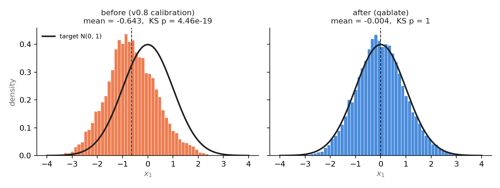

# qablate

**Classical-quantum ablation studies for Bayesian parameter inference.**

qablate swaps the components of an inference algorithm (the proposal and the
acceptance rule of Metropolis-Hastings, the sampler and the optimizer of a
variational fit, the operators of a genetic algorithm) between a classical
implementation and a quantum-circuit implementation, one component at a time,
and measures what changes. The question it answers is *fidelity*: does the
circuit-based version reproduce the classical result, and what happens to it
under realistic noise? **No quantum advantage is claimed or expected: every
quantum component here is classically simulable at the sizes used.**

It grew out of the undergraduate thesis *Quantum Algorithms for Cosmology: a
classical-quantum ablation framework for Bayesian parameter inference*
(Universidad Iberoamericana, 2026) and ships the flat background cosmology
used there (ΛCDM, wCDM, CPL, PEDE, GEDE with H(z) and Pantheon 2018 data), but
the core works with any log-density.

## What each quantum component actually does

| Component | What the circuit does | Runs on hardware? | Adds anything beyond classical? |
|---|---|---|---|
| `RandomCircuitProposal` | Random-walk increments read from a randomly parameterized circuit (Sarracino et al. 2025): ⟨Z⟩ per qubit (`route="counts"`) or signed amplitudes (`route="statevector"`). Increments do not depend on the current point; scale is calibrated and a random sign makes the proposal exactly symmetric. | counts route: yes; statevector route: no | No. A different increment distribution, same target. |
| `AmplitudeEncodedMetropolis` | The Metropolis probability A = min(1, e^Δ) is computed classically, loaded into one qubit with RY, and read back. On an ideal simulator it reproduces classical Metropolis decision for decision. | yes (A estimated from shots) | No. It is a plumbing check; under noise it breaks detailed balance, and the sampler warns. |
| `BornMachineVI` | A variational distribution on a 2ⁿ-point-per-parameter grid is the output distribution of a hardware-efficient circuit, trained on reverse KL by COBYLA or exact parameter-shift gradients. | sampling yes; training needs exact probabilities (simulator) | The one genuinely quantum *model*; reverse KL makes it under-estimate widths when it misses correlations (reported). |
| `experimental.GeneticAlgorithm` circuit operators | Initialization, mutation and crossover on a grid genome, sampled from circuits that start and end in the computational basis. | yes | No. Their outputs have exactly the distribution of classical coin flips; each has a classical twin on the same grid. |

## Install

```bash
pip install "qablate[all] @ git+https://github.com/AndrewGari05/Quantum-Algorithms-Cosmology"
```

`import qablate` needs only NumPy and SciPy; Qiskit/Aer (`[quantum]`), IBM
Runtime (`[ibm]`), ArviZ (`[diagnostics]`) and Matplotlib (`[plot]`) load when
used. Python ≥ 3.10.

## Quick start: bring your own log-density

Method names follow emcee's (`run_mcmc`, `get_chain`, `acceptance_fraction`).

```python
import numpy as np
from qablate import (MetropolisHastings, GaussianProposal, RandomCircuitProposal,
                     MetropolisAcceptance, AmplitudeEncodedMetropolis, Study, diagnostics)

def log_prob(x):                                   # banana-shaped target, vectorized
    return -0.5 * (x[:, 0] ** 2 + (x[:, 1] - x[:, 0] ** 2) ** 2 / 0.25)

def run(parts, rng):
    mh = MetropolisHastings(log_prob, ndim=2, nchains=6, rng=rng, **parts)
    mh.run_mcmc(np.zeros((6, 2)), 20000)
    return {"chain": mh.get_chain(discard=2000)}

study = Study(
    {"proposal":   (lambda: GaussianProposal(0.7), lambda: RandomCircuitProposal(0.7)),
     "acceptance": (MetropolisAcceptance, AmplitudeEncodedMetropolis)},
    run,
    equivalent=[({"proposal": True}, {"proposal": True, "acceptance": True})])
runs = study.run(study.ladder(), seed=42)          # C,C -> Q,C -> Q,Q from the same seed
print(study.check_equivalences(runs, ["chain"]))   # declared-identical pair: True
for r in runs:
    print(r.label, diagnostics.summary(np.swapaxes(r.outputs["chain"], 0, 1)))
```

Noise and hardware are a backend choice:

```python
from qablate import AerBackend, IBMRuntimeBackend
prop = RandomCircuitProposal(0.5, backend=AerBackend("FakeBrisbane"), shots=128)
# IBMRuntimeBackend(service.backend("ibm_torino")) runs the same circuits on a device
```

To compare locations fairly, compile once and run the same ISA circuit on the
ideal simulator, the device's noisy twin and the device, with per-job timing
(`qablate.hardware.DeviceCompiler` / `DeviceBackend`). The thesis protocol
`python -m thesis hardware` does this for QMCMC, QVMC (SPSA) and QGA; see
[docs/hardware.md](docs/hardware.md).

## Cosmology

```python
from qablate.cosmology import Posterior, fit_statistics
post = Posterior("cpl", "CC+BAO+Pantheon")          # vectorized log_prob, open-box prior
st = fit_statistics(post, post.model.fiducial)      # best fit, chi2, AIC, BIC
```

Datasets: `CC+BAO` (51-point compilation of Magaña et al. 2018), `CC` (its 31
cosmic-chronometer rows), `Pantheon` (Scolnic et al. 2018, statistical errors),
`Pantheon+sys` (with the systematic covariance, downloaded and checksummed on
first use), and their combinations.

## Why the proposal needed fixing

The thesis code calibrated the circuit proposal by subtracting an estimated
mean. The raw increments are exactly symmetric, so that subtraction left a
small constant drift, and a Metropolis chain with a drifting proposal samples
the wrong distribution. qablate scales the increments and flips their sign at
random, which makes the proposal symmetric by construction; every
proposal × acceptance combination is now tested for stationarity on a known
target.



## Known limitations and data caveats

* The 20 BAO rows of `CC+BAO` come from overlapping survey volumes but are
  treated as independent, and depend on a fiducial sound horizon; with only
  non-overlapping BAO, σ(H0) grows by about 50 %.
* `Pantheon` omits systematic errors (σ(Ωm) 0.0104 → 0.0143 with them); use
  `Pantheon+sys` to check.
* GEDE uses the ΛCDM transition redshift instead of the Δ-dependent one of
  Li & Shafieloo (2020) (≤ 1.8 % in H(z) inside the prior).
* Reverse-KL variational widths are biased low when the circuit does not
  capture parameter correlations; compare `VIResult.correlation` with the target's.
* The VI ladder has no circuit-free baseline: its classical rung is the same
  Born-machine ansatz, simulated exactly and trained with COBYLA.
* Circuit sizes are small (≤ ~20 qubits); nothing here scales to an advantage.

## Reproducing the thesis

`thesis/` runs the three ablation ladders (MCMC, VI, genetic) over models,
grids and noise levels with this library and writes one tidy results table
per task (`python -m thesis --help`). It is a re-analysis, not the source of
the thesis numbers.

The numbers in the thesis are reproduced only from the tag
`v0.8.2-thesis-defense` (created when the corrected numbers are approved).
Tag `v0.8.1-thesis` is the legacy baseline (the code of the original
campaign); branch `thesis-errata` holds one commit per correction, and
[ERRATA.md](ERRATA.md) lists each one, whether it changed results, and the
measured before/after.

## How this code was developed

The research questions, models, experiments and campaigns are the author's.
Development used an AI coding assistant (Claude, by Anthropic) for code review
and bug hunting, the refactoring of the thesis scripts into the qablate
library, tests and documentation. Every change was reviewed and approved by
the author, who is responsible for the code and its results; the defects the
review found are documented, with their measured effect, in
[ERRATA.md](ERRATA.md).

## Development

```bash
pip install -e ".[dev]"
pytest            # unit, statistical-validity and golden tests; add -m slow for noisy-backend runs
ruff check src thesis tests
```

MIT licensed. If you use qablate, please cite it ([CITATION.cff](CITATION.cff)).
